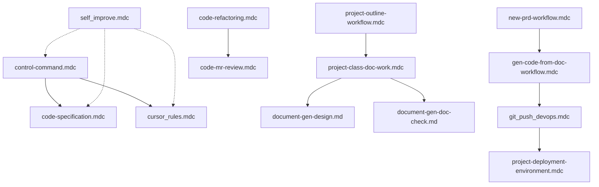

# Cursor Rules 导航文档

本目录包含了项目开发过程中的各种规则文档，用于指导AI助手和开发人员遵循统一的开发规范和工作流程。

## 📋 目录结构

```
.cursor/rules/
├── control-command.mdc              # 元指令与控制指令
├── code-specification.mdc           # 代码开发约束规范
├── code-refactoring.mdc            # 代码重构优化规则
├── code-mr-review.mdc              # MR代码审核规则
├── new-prd-workflow.mdc            # PRD需求分析工作流程
├── project-outline-workflow.mdc     # 项目大纲生成流程
├── project-class-doc-work.mdc      # 类文档生成工作流程
├── document-gen-design.md          # 功能设计文档生成
├── document-gen-doc-check.md       # 文档完整性检查
├── gen-code-from-doc-workflow.mdc  # 从文档生成代码流程
├── git_push_devops.mdc             # GIT推送与部署流程
├── project-deployment-environment.mdc # 项目部署环境配置
├── cursor_rules.mdc                # Cursor基础规则
└── self_improve.mdc                # 规则自我改进指南
```

## 🎯 核心规则文件

### 1. **control-command.mdc** - 元指令与控制指令
- **作用**：定义AI助手的工作模式和行为准则
- **核心内容**：
  - RIPER-5模式（研究、创新、规划、执行、审查）
  - 模式切换规则和限制
  - 自定义指令集（项目大纲、代码文档、测试等）
- **应用场景**：控制AI助手的行为模式，确保按照既定流程工作

### 2. **code-specification.mdc** - 代码开发约束规范
- **作用**：统一项目的技术栈和编码规范
- **核心内容**：
  - Java项目技术栈（JDK 1.8、SpringBoot、MyBatisPlus）
  - GIT分支策略和提交规范
  - 单元测试编写约束
- **应用场景**：日常代码开发、代码提交、测试编写

### 3. **cursor_rules.mdc** - Cursor基础规则
- **作用**：定义AI助手的基本行为准则
- **核心内容**：
  - 中文回复要求
  - 任务执行策略
  - MCP Interactive Feedback规则
  - Memory使用指南
- **应用场景**：所有交互场景的基础规则

## 📚 文档生成类规则

### 4. **project-outline-workflow.mdc** - 项目大纲生成流程
- **作用**：生成项目整体技术文档
- **核心内容**：
  - 项目结构分析
  - 架构图和流程图生成
  - 技术栈识别
- **应用场景**：项目初始化、项目文档更新

### 5. **project-class-doc-work.mdc** - 类文档生成工作流程
- **作用**：为项目中的每个类生成详细文档
- **核心内容**：
  - 类结构分析
  - 方法实现逻辑描述
  - 文档完整性自查
- **应用场景**：代码文档化、API文档生成

### 6. **document-gen-design.md** - 功能设计文档生成
- **作用**：生成功能模块的设计文档
- **核心内容**：
  - 功能概述和架构
  - 核心模块说明
  - 测试用例设计
- **应用场景**：功能设计、技术方案编写

### 7. **document-gen-doc-check.md** - 文档完整性检查
- **作用**：验证文档与源码的一致性
- **核心内容**：
  - 源码逻辑匹配度验证
  - 文档结构检查
  - 自动修正机制
- **应用场景**：文档质量保证、文档更新验证

## 🔄 代码重构与审核

### 8. **code-refactoring.mdc** - 代码重构优化规则
- **作用**：指导代码重构过程
- **核心内容**：
  - 重构原则（SOLID、DRY、KISS）
  - 渐进式重构策略
  - 功能完整性验证
- **应用场景**：技术债务清理、架构优化

### 9. **code-mr-review.mdc** - MR代码审核规则
- **作用**：代码合并请求的审核标准
- **核心内容**：
  - Code Review标准
  - 审核检查项
  - 审核报告生成
- **应用场景**：PR/MR审核、代码质量控制

### 10. **new-prd-workflow.mdc** - PRD需求分析工作流程
- **作用**：解析PRD需求文档
- **核心内容**：
  - 需求分析方法
  - 项目蓝图生成
  - 开发计划制定
- **应用场景**：需求分析、项目规划

## 🚀 开发与部署

### 11. **gen-code-from-doc-workflow.mdc** - 从文档生成代码流程
- **作用**：根据技术文档生成项目代码
- **核心内容**：
  - 项目初始化
  - 代码生成计划
  - 文档与代码一致性检查
- **应用场景**：快速原型开发、代码生成

### 12. **git_push_devops.mdc** - GIT推送与部署流程
- **作用**：代码提交和环境部署的标准流程
- **核心内容**：
  - GIT推送流程
  - Jenkins构建
  - K8S部署验证
- **应用场景**：代码发布、环境部署

### 13. **project-deployment-environment.mdc** - 项目部署环境配置
- **作用**：记录项目部署环境信息
- **核心内容**：
  - Jenkins job配置
  - Kubernetes namespace配置
  - 部署参数说明
- **应用场景**：环境配置参考、部署操作

## 🔧 辅助规则

### 14. **self_improve.mdc** - 规则自我改进指南
- **作用**：持续改进规则文档
- **核心内容**：
  - 规则改进触发条件
  - 规则更新策略
  - 文档同步机制
- **应用场景**：规则维护、最佳实践沉淀

## 🔗 规则间的关系

### 规则体系架构图


### 规则依赖关系



## 📝 使用建议

1. **新项目启动**：
   - 使用 `project-outline-workflow.mdc` 生成项目大纲
   - 使用 `project-class-doc-work.mdc` 生成类文档
   - 遵循 `code-specification.mdc` 进行开发

2. **需求开发**：
   - 使用 `new-prd-workflow.mdc` 分析需求
   - 使用 `gen-code-from-doc-workflow.mdc` 生成代码

3. **代码优化**：
   - 使用 `code-refactoring.mdc` 进行重构
   - 使用 `code-mr-review.mdc` 进行代码审核
   - 使用 `document-gen-doc-check.md` 验证文档

4. **部署发布**：
   - 使用 `git_push_devops.mdc` 推送代码
   - 参考 `project-deployment-environment.mdc` 配置环境

## 🎯 核心原则

1. **自动化优先**：所有流程尽可能自动化执行
2. **文档驱动**：先有文档，后有代码
3. **质量保证**：每个环节都有验证机制
4. **持续改进**：根据实践不断优化规则

## 📌 注意事项

- 所有规则文件都使用 `.mdc` 或 `.md` 格式
- `alwaysApply: true` 的规则会自动应用
- `alwaysApply: false` 的规则需要显式调用
- 规则可以通过 `fetch_rules` 工具获取详细内容

## 🔄 更新维护

- 定期根据 `self_improve.mdc` 的指导更新规则
- 新增规则时更新本导航文档
- 保持规则间的一致性和完整性 